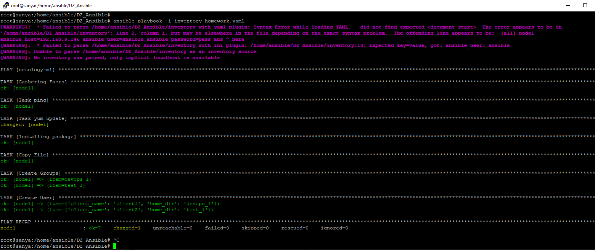
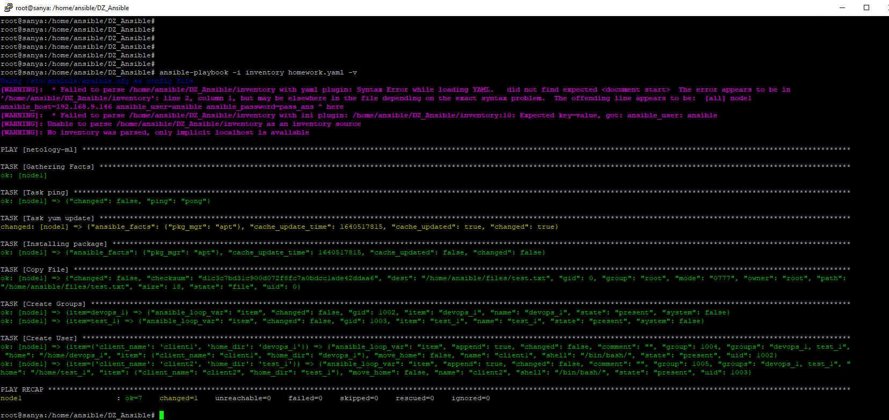

### Домашняя работа к занятию “Ansible”

#### Цель: написать рабочий playbook Ansible, чтобы научится работать с Ansible, его синтаксисом, и понимать, как через него настраивается раскатка ПО

#### Задание: сделать yaml playbook

1. Имя плейбука homework.yaml
2. Inventory из минимум одного хоста, если есть
возможность, то два лучше
3. Авторизация должна быть настроена через
техническую уз ansible
4. Наименование netology-ml
5. Проверка через метод ping доступности хостов
Через var установка пакетов net_tools, git, tree, htop, mc, vim
7. Использование update
8. Копирование текстового файла test.txt
9. Создание в цикле групп пользователей devops_1, test_1 с созданием пользователей и директорий home devops_1, test_1

#### Результат:
	-) файл readme.md с выполненным заданием в репозитории GitHub
	-) приложить полученный inventory и homework.yaml
	-) лог выполнения плейбук

Инструменты: репозиторий с домашним заданием https://github.com/Netology-DS/devops-mlops/tree/master/Ansible
*************************************************************************

## Решение:

Установил ansible
Провел необходимые настройки.

Решение для одного хоста. Второй и третий хосты закомментировал.

Запуск (путь к inventory при этом должен быть прописан в /etc/ansible):

	ansible-playbook homework.yaml

или можно запустить командой:

	ansible-playbook -i inventory homework.yaml

P.S. Warnings не поборол. Но задание отработало и так.
	
Прикладываю файлы и скрины:

[Inventory](inventory)

[Homework playbook](homework.yaml)

