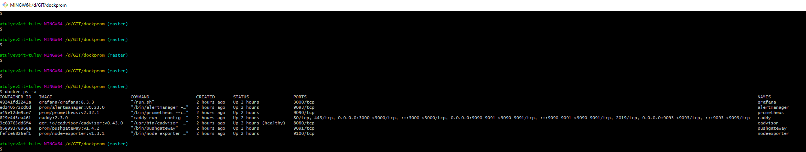
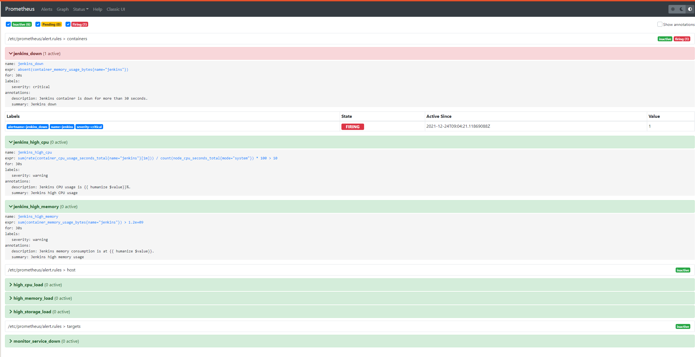
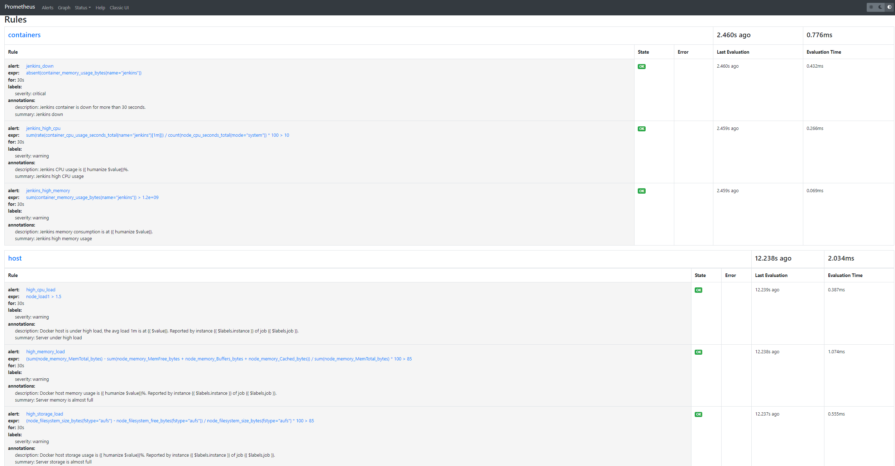
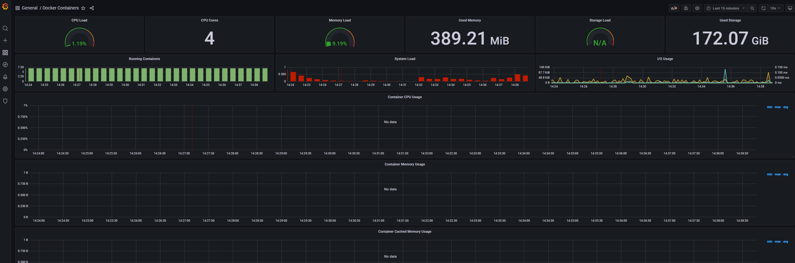
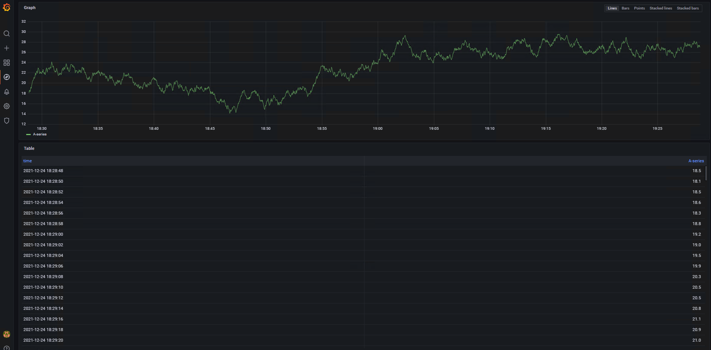

### Домашняя работа к занятию “Мониторинг”

#### Цель задания:
Научиться пользоваться инструментами bugtrasing и мониторинга, чтобы понимать, каким образом можно мониторить ваши приложения и готовить логи.

#### Задание:
Необходимо установить и настроить на базе образа Grafana + Prometheus + alertmanager:

Скачиваем образ из репозитория - https://github.com/stefanprodan/dockprom
Собираем
Поднимаем
Проверяем, что всё работает через docker ps
Логинимся в Prometheus и изучаем настроенные alerts, rules
Логинимся в Grafana
Смотрим, что настроено в дашбордах и explore
Домашнее задание выполните в файле readme.md в github репозитории.

Результат:
В личном кабинете отправьте на проверку ссылку на .md-файл в вашем репозитории.
Перечислите алерты, которые настроены в Prometheus alerts.
Перечислите количество dashboards в Grafana, для какого ПО они?
Сделайте скриншот работающего dashboards docker containers grafana, перечислите метрики, которые там есть.

Инструменты:
Образ для работы - https://github.com/stefanprodan/dockprom
*************************************************************************

## Решение:

1. Склонировал репозиторий.
2. Поднял (запустил) из образа.
3. Проверяю что все нормально поднялось и работает (см скрин: docker_ps_-a.png) .
4. Подключился к Prometheus (см скрин: Alerts.png) .
5. Настроенные alerts: 
    -) 3 alerts мониторинга контейнеров Jenkins (работоспособность Jenkins, использование ЦПУ и памяти) (По скрину Jenkins не работает)
    -) 3 alerts мониторинга хоста (загрузка процессора, памяти и хранилища)
    -) 1 alert мониторинга состояния сервиса (работает/ не работает)
    

6. Настроенные rules (см скрин: Rules.png) .
7. Подключился к Grafana:  (см скрин: DashBoards.png) .
    На дашборде показывается:
        -) испеользование процессора;
        -) кол-во ядер;
        -) загрузка памяти %;
        -) использовано памяти
        -) загрузка хранилища %;
        -) использовано хранилища;
        -) мониторинг запущенных контейнеров;
        -) загрузка системы;
        -) использование устройств чтения/записи.
        
8. Explore (см скрин: Explore.png) .

